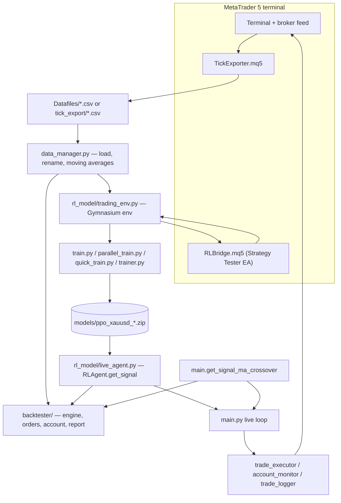

# xauusd-rl-engine

A Windows/MetaTrader 5 research sandbox for XAU/USD (gold) M1 trading. It contains a
PPO reinforcement-learning agent, a moving-average crossover baseline to measure it
against, a cost-aware backtester, and a live execution loop that drives an MT5 demo
account through the `MetaTrader5` Python API.

## Status

Experimental and unfinished. Treat it as a personal research sandbox, not a product.
Specifically:

- No trained model, no historical data, and no `config.py` are committed — you have to
  supply all three before anything runs (see [Setup](#setup)).
- There are no published performance results in this repo. Any claim about how the agent
  performs would have to come from your own run.
- Test coverage is one file (`tests/test_data_manager.py`) covering the data layer, the
  MA signal, and the metrics helper. The RL environment, the backtester and the
  execution layer are untested.
- `review/` is a frozen duplicate of the RL code as it stood at an earlier review point.
  Nothing imports it, and it has since drifted — see
  [The `review/` folder](#the-review-folder).
- There is no CI.

## Risk notice

This is trading software. It can place real orders.

- Nothing here is financial advice, and no part of it is a recommendation to trade.
- Trading gold with leverage can lose money faster than the account can absorb.
  `config.MAX_POSITIONS` and `config.DEFAULT_SL_POINTS` are the only guard rails, and
  the live loop closing all open positions on shutdown is not a risk management system.
- Use a **demo/paper account only**. `MT5_ACCOUNT` in `config.py` should point at a
  demo server. The code does not check whether the account it logs into is a demo one.
- The backtester models spread, slippage, latency, commission, swap and margin, but a
  backtest is still a simulation. Backtest results do not carry over to live trading.

## How it works

Everything downstream of the market data speaks one interface: a `signal_fn(state)`
that takes a dict (`close`, `ma5`, `ma10`, `ma20`, `ma100`, `has_position`,
`position_type`, `position_profit`) and returns the string `"BUY"`, `"SELL"`,
`"CLOSE"` or `"HOLD"`. Two implementations exist:

- `main.get_signal_ma_crossover` — the baseline. Enters long when MA5 > MA20 and
  MA10 > MA100, short on the mirror condition, and closes when MA5 crosses back through
  MA20.
- `rl_model.live_agent.RLAgent.get_signal` — loads the trained PPO model from
  `models/ppo_xauusd_best.zip`, builds the 14-feature observation and maps the discrete
  action (0–3) back to the same four strings.

Because the interface is shared, the same signal function can be run by the live loop
(`main.py`), the standalone backtester (`backtester/run.py`) and the evaluator
(`rl_model/evaluate.py`) without change.

Training happens in `rl_model/trading_env.py`, a Gymnasium environment over an M1
DataFrame: `Discrete(4)` actions, a `Box(14,)` observation, one position at a time,
a 30-bar minimum hold, margin checks against a 1:100 leverage default, and optional
randomisation of episode start, spread and slippage. The observation vector and reward
terms are documented in [docs/REWARD_AND_OBSERVATIONS.md](docs/REWARD_AND_OBSERVATIONS.md);
class-level notes are in [docs/CLASS_REFERENCE.md](docs/CLASS_REFERENCE.md).

A separate path runs training or backtesting **inside MT5** rather than over a
DataFrame: `RLBridge.mq5` runs in the Strategy Tester and exchanges CSV files
(`state.csv` / `action.csv` / `result.csv`) with `rl_model/mt5_bridge.py` through
`%APPDATA%\MetaQuotes\Terminal\Common\Files\rl_bridge\`. `rl_model/mt5_backtest_env.py`
wraps that bridge as a Gymnasium environment, so the EA does the order execution with
the broker's own spreads and fills. The bridge polls at 1 ms and is slow by design.



## Requirements

- **Windows.** The `MetaTrader5` Python package is Windows-only, and several paths are
  built from `%APPDATA%`. There is no Linux or macOS path in this code.
- A MetaTrader 5 terminal, installed and logged in to a demo account.
- Python. No version is pinned anywhere in the repo; the dependency set
  (`stable-baselines3` 2.x, `gymnasium` 0.29, `torch` 2.x, `MetaTrader5` 5.0.45) is what
  CPython 3.10–3.11 on Windows supports.
- An NVIDIA GPU is optional. Training falls back to CPU, and `--cpu` forces it.

Dependencies live in two files:

| File | Contents |
|---|---|
| `requirements.txt` | `MetaTrader5`, `pandas`, `numpy`, `pytest` — enough for the MA baseline, data layer and tests |
| `rl_model/requirements.txt` | `torch`, `stable-baselines3`, `gymnasium`, `tensorboard`, `tqdm` — needed for anything RL |

Not listed in either file but imported by `backtester/visualizer.py`: **plotly**. Install
it (`pip install plotly`) or pass `--no-chart` to the backtester.

## Setup

```powershell
git clone https://github.com/chinthakat/xauusd-rl-engine.git
cd xauusd-rl-engine

python -m venv .venv
.\.venv\Scripts\Activate.ps1

pip install -r requirements.txt
pip install -r rl_model\requirements.txt    # only to train or run the RL agent
pip install plotly                          # only for backtest charts

# For a CUDA build of torch, follow the note in rl_model/requirements.txt:
# pip install torch --index-url https://download.pytorch.org/whl/cu124

copy config.example.py config.py
# then edit config.py with your demo account details
```

`config.py` is git-ignored. It is not optional — every module does `import config`, so
nothing starts without it.

### Getting data

`config.DATA_DIR` (default `Datafiles/`) is expected to hold M1 CSV files whose names
contain `XAUUSD`; `data_manager.load_all_csv_data()` concatenates every match. No data
is committed here — CSVs are git-ignored on purpose. Two ways to produce them:

1. Run `mql5/TickExporter.mq5` in the MT5 Strategy Tester on XAUUSD M1. It writes to
   `%APPDATA%\MetaQuotes\Terminal\Common\Files\tick_export\`, which `trainer.py` and the
   parallel/quick trainers read directly (`XAUUSD_M1_export.csv`).
2. Export M1 history from the MT5 terminal yourself. `data_manager.load_csv_data`
   accepts either a `Date,Time,Open,High,Low,Close,TickVolume,RealVolume,Spread` layout
   with `%Y.%m.%d %H:%M` timestamps, or a single `time` column.

## Configuration

All configuration is Python constants in `config.py`, read as `import config`. Copy
`config.example.py` and fill it in. Never commit real credentials.

| Key | Used by | Meaning |
|---|---|---|
| `MT5_ACCOUNT` | `mt5_connection.py` | MT5 login number (int) |
| `MT5_PASSWORD` | `mt5_connection.py` | MT5 account password |
| `MT5_SERVER` | `mt5_connection.py` | Broker server name |
| `MT5_PATH` | `mt5_connection.py` | Path to `terminal64.exe`; falsy lets MT5 auto-detect |
| `SYMBOL` | data manager, executor, monitor | Instrument name, e.g. `XAUUSD` |
| `LOT_SIZE` | executor, backtest, RL envs | Volume per trade |
| `MAGIC_NUMBER` | `trade_executor.py` | Order magic number identifying this system |
| `ORDER_COMMENT` | `trade_executor.py` | Comment written on orders (`CLOSE_` prefix on exits) |
| `MAX_SLIPPAGE` | `trade_executor.py` | Order `deviation`, in points |
| `MAX_SPREAD_POINTS` | `trade_executor.py` | Entry is refused above this spread |
| `MAX_POSITIONS` | `trade_executor.py` | Cap on simultaneous open positions |
| `DEFAULT_SL_POINTS` | `trade_executor.py` | Fallback stop-loss distance, in points |
| `MA_PERIODS` | `data_manager.py`, tests | MA windows to compute; the signal code assumes `[5, 10, 20, 100]` |
| `INITIAL_BARS` | `main.py` | M1 bars fetched per live-loop poll |
| `LOOP_INTERVAL_SECONDS` | `main.py` | Sleep between live-loop iterations |
| `DATA_DIR` | `data_manager.py`, tests | Folder scanned for `*XAUUSD*.csv` |
| `LOG_DIR` | `main.py`, `trade_logger.py` | Root for logs and CSV output |
| `SYSTEM_LOG_FILE` | `main.py` | Debug log file path |
| `TRADE_LOG_FILE` | `trade_logger.py` | Appended trade CSV |
| `ACCOUNT_LOG_FILE` | `trade_logger.py` | Appended account-snapshot CSV |

One environment variable is read, and only as a path base: **`APPDATA`**, used to locate
`%APPDATA%\MetaQuotes\Terminal\Common\Files` for the MQL5 bridge and tick exports
(`backtester/tick_data.py`, `rl_model/mt5_bridge.py`, `trainer.py`, and the parallel and
quick trainers). Nothing else uses the environment.

Backtester settings are a dataclass rather than config keys — see `backtester/config.py`
(`BacktestConfig`, plus the `ideal_config`, `realistic_config` and `harsh_config`
presets).

## Usage

Sanity-check the connection and the data layer first — both modules are runnable:

```powershell
python mt5_connection.py     # prints account, server, balance, trade_allowed
python data_manager.py       # loads a CSV from DATA_DIR and validates MA5
```

### Backtest and live loop

```powershell
python main.py --backtest                     # MA crossover over Datafiles/*.csv
python main.py --backtest --model rl_ppo      # same data, trained PPO agent
python main.py                                # LIVE on the configured MT5 account
python main.py --model rl_ppo                 # LIVE, PPO agent
```

`main.py --backtest` is a crude built-in simulation: close-to-close fills, no spread,
no commission. The real backtester is separate and models costs:

```powershell
python -m backtester.run                          # MA crossover, realistic preset
python -m backtester.run --model rl_ppo           # PPO agent
python -m backtester.run --preset ideal           # no spread/slippage/commission/swap/margin
python -m backtester.run --preset harsh           # stress test
python -m backtester.run --spread 30 --tick-mode every_tick
python -m backtester.run --no-chart --export-csv
```

Other flags: `--no-spread`, `--no-slippage`, `--no-latency`, `--no-commission`,
`--no-swap`, `--no-margin`, `--lot-size`, `--balance`, `--leverage`, `--tick-data`,
`--compare-mt5`.

### Training

```powershell
python trainer.py                                  # interactive menu: list / train / evaluate
python -m rl_model.train --episodes 50             # single env
python -m rl_model.train --mode mt5                # train through the RLBridge EA
python -m rl_model.parallel_train --iterations 5   # one subprocess env per month
python rl_model\quick_train.py --month 0 --iterations 5 --ent-coef 0.1
python -m rl_model.evaluate --model best           # compare PPO against the MA baseline
```

`trainer.py` is the interactive front end: it lists the monthly chunks it found, holds
the last two months out as an eval set, and offers single-month, combined or parallel
training modes. Models are written to `models/` as `ppo_xauusd_best.zip` and
`ppo_xauusd_final.zip`; TensorBoard logs go to `logs/tensorboard/`. Neither directory is
committed.

### MQL5 side

Copy the files in `mql5/` into your terminal's `MQL5\Experts\` folder and compile them in
MetaEditor.

| EA | Purpose |
|---|---|
| `TickExporter.mq5` | Run in the Strategy Tester to dump M1 OHLCV, spread and MAs to `Common\Files\tick_export\` |
| `RLBridge.mq5` | Strategy Tester or live EA that exchanges state/action/result CSVs with the Python agent |
| `MACrossoverTest.mq5` | The MA crossover rules reimplemented in MQL5, to cross-check the Python backtester |

## Project layout

```
.
├── main.py                  Live loop and simple built-in backtest; MA crossover signal
├── config.example.py        Template for the git-ignored config.py
├── mt5_connection.py        MT5 terminal init, login, health checks, reconnect
├── data_manager.py          MT5 bar fetching, CSV loading, moving averages
├── trade_executor.py        Order send: buy/sell/close/modify, spread and position pre-checks
├── account_monitor.py       Balance, equity, open positions, trade history
├── trade_logger.py          Trade/account CSV logging; win rate, profit factor, drawdown, Sharpe
├── trainer.py               Interactive training/evaluation menu
├── rl_model/                PPO agent
│   ├── trading_env.py       Gymnasium env over an M1 DataFrame
│   ├── features.py          The 14-dimension observation vector
│   ├── train.py             Single-env training
│   ├── parallel_train.py    SubprocVecEnv training, one env per month
│   ├── quick_train.py       One-month verbose run for debugging
│   ├── evaluate.py          PPO vs MA baseline
│   ├── live_agent.py        Loads the model, exposes get_signal(state)
│   ├── mt5_bridge.py        File IPC with RLBridge.mq5
│   └── mt5_backtest_env.py  Gymnasium env backed by the MT5 Strategy Tester
├── backtester/              Cost-aware backtester
│   ├── config.py            BacktestConfig dataclass and presets
│   ├── engine.py            Bar loop, tick generation, signal dispatch
│   ├── order_manager.py     Spread, slippage, latency, SL/TP, position tracking
│   ├── account.py           Balance, equity, margin, swap, commission
│   ├── tick_generator.py    ohlc / open_only / every_tick tick synthesis
│   ├── tick_data.py         Loads TickExporter.mq5 output
│   ├── report.py            Terminal report and trade log
│   └── visualizer.py        Plotly candlestick and equity chart (writes logs/backtest_chart.html)
├── mql5/                    Expert Advisors (see above)
├── review/                  Frozen snapshot of the RL code at an earlier review point
├── docs/                    Class reference, reward and observation reference
└── tests/                   pytest suite for the data layer
```

## The `review/` folder

`review/` was added in the "model refinements" commit as a point-in-time copy of the RL
code so it could be read as a unit. Nothing imports it. Today:

- `review/data_manager.py`, `evaluate.py`, `train.py`, `parallel_train.py`,
  `quick_train.py`, `features.py` and `__init__.py` are byte-identical to their live
  counterparts.
- `review/trainer.py` and `review/trading_env.py` have diverged. The live
  `rl_model/trading_env.py` added two reward components — a differential-Sharpe term and
  an exponential inactivity penalty — that the review copy does not have, so the two
  files now train against different objectives.

Keep it or delete it, but do not assume it is in sync with `rl_model/`.

## Tests

```powershell
pip install -r requirements.txt
python -m pytest tests -v
```

`tests/test_data_manager.py` holds 28 tests across four classes: CSV loading and
integrity, moving-average correctness, the MA crossover signal, and the trade-logger
metrics. The CSV tests skip themselves when `config.DATA_DIR/XAUUSD_M1_2025_03.csv` is
missing, so on a fresh clone with no data only the signal and metrics tests actually run.

## License

MIT — see [LICENSE](LICENSE).
