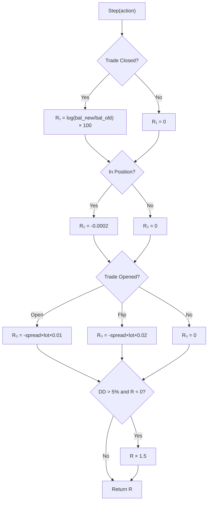

# Reward Function & Observation Space (v3 — Post Review)

## Observation Space

`Box(14,)` float32, range [-10, 10]

### Market Features (12 dims, pre-computed per bar)

| # | Feature | Formula | Purpose |
|:-:|---------|---------|---------|
| 0 | `close_ma5_ratio` | Close/MA5 - 1 | Short-term trend deviation |
| 1 | `close_ma10_ratio` | Close/MA10 - 1 | Medium-term trend |
| 2 | `close_ma20_ratio` | Close/MA20 - 1 | Trend strength |
| 3 | `close_ma100_ratio` | Close/MA100 - 1 | Long-term bias |
| 4 | `ma5_ma20_diff` | (MA5 - MA20) / Close | Crossover signal |
| 5 | `ma10_ma100_diff` | (MA10 - MA100) / Close | Trend confirmation |
| 6 | `return_5` | 5-bar % change | Short momentum |
| 7 | `return_10` | 10-bar % change | Medium momentum |
| 8 | `return_20` | 20-bar % change | Longer momentum |
| 9 | `volatility_20` | 20-bar std × 100 | Risk/vol gauge |
| 10 | `hour_sin` | sin(2π × hour/24) | Session cycle |
| 11 | `hour_cos` | cos(2π × hour/24) | Session cycle |

### Position Features (2 dims, live per step)

| # | Feature | Value | Purpose |
|:-:|---------|-------|---------|
| 12 | `position` | -1 / 0 / +1 | Current direction |
| 13 | `norm_pnl` | unrealized_pnl / balance, clipped ±1 | Trade health |

> All features clipped to [-5, 5], NaN/inf → 0.

---

## Reward Function (4 Components Only)

```
R(step) = R_pnl + R_hold + R_spread + R_drawdown
```

### Component 1 — Realized P/L (trade close only)

```python
if trade_closed and pnl != 0:
    R_pnl = log(balance_after / balance_before) × 100
```

| Example | Reward |
|---------|-------:|
| Win $10 on $10,000 | +0.10 |
| Win $50 on $10,000 | +0.50 |
| Lose $10 on $10,000 | -0.10 |
| Lose $100 on $10,000 | -1.01 |

Log-return is asymmetric — losses hurt more than equal-size wins.

### Component 2 — Holding Cost

```python
if in_position:
    R_hold = -0.0002  # per step
```

| Duration | Cumulative Cost |
|----------|---------------:|
| 30 bars (min hold) | -0.006 |
| 100 bars | -0.020 |
| 500 bars | -0.100 |
| 1000 bars | -0.200 |

Small enough that a profitable trade easily outweighs it. Prevents indefinite holds.

### Component 3 — Spread Cost (on open)

```python
if open_trade:
    R_spread = -spread × lot_contract × 0.01
    # = -25pts × 0.01 × 1 × 0.01 = -0.025

if flip (close + open):
    R_spread = -spread × lot_contract × 0.02  # Double
    # = -0.050
```

### Component 4 — Drawdown Multiplier

```python
if equity_drawdown > 5% and reward < 0:
    R_total *= 1.5  # Amplify negative reward
```

Makes the agent extra cautious when already losing.

### Terminal Conditions

```python
if bankruptcy (equity ≤ 0):
    R_terminal = -10.0
    episode_ends = True

if margin_call (equity < 20% of margin):
    R_terminal = -10.0
    episode_ends = True

if episode_end and position_open:
    force_close → R_pnl added
```

---

## What Was Removed (vs v2)

| Component | Why Removed |
|-----------|-------------|
| Smart HOLD shaping (+reward when P/L grows) | Over-engineered, biased HOLD action |
| Trade completion bonus (+0.01/+0.02) | Incentivized rapid flipping |
| Inactivity penalty (flat >200 steps) | Forced trading in flat markets |
| Churning penalty (avg duration check) | Used global average, temporal distortion |

## Anti-Overfitting Randomization (Training Only)

| Feature | Range | Purpose |
|---------|-------|---------|
| Random episode start | 0 to N-500 bars | No sequence memorization |
| Random spread | base ±30% | No fixed-cost exploitation |
| Random slippage | 0 to 3 points | Realistic fill variation |

All disabled during evaluation for deterministic results.

---

## Reward Flow


